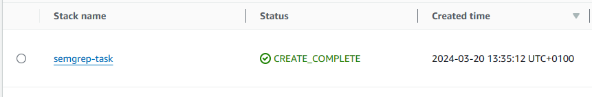
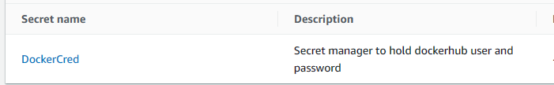
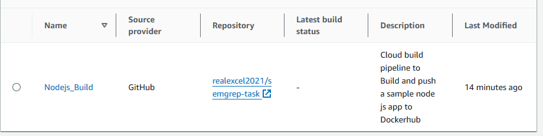
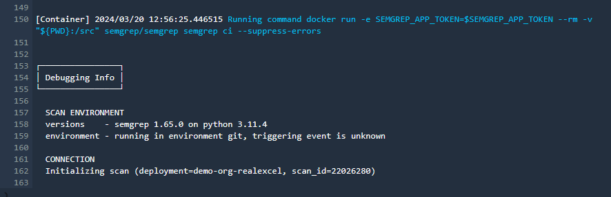
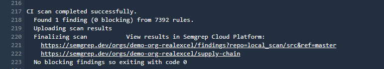
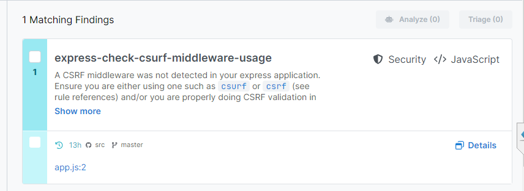
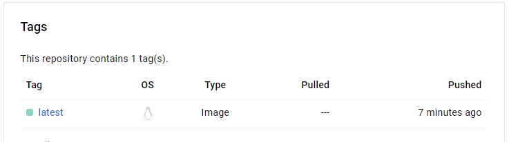

# Semgrep Task

This repo contains a sample node js app that returns hello world. This application is dockerized using the Dockerfile and utilizes AWS codebuild to build the dockerfile and push the image to dockerhub.

In the codebuild steps, a sample CI test is carried out by semgrep using semgrep's doker image, and the test results and outputs are retured to the semgrep orgnization.

## Architecture

To create the environment on AWS, I made use of cloudformation to build a stack that creates the following:
 - Codebuild
 - IAM role for code build
 - secret manager (To store Dockerhub username, Dockerhub token/password, Semgrep Token)

## Replicate
To spin up the environment on your AWS account, using the CLI, execute the commandd below in the directory of this project.

```
aws cloudformation deploy --stack-name semgrep-task --region us-east-1 --capabilities CAPABILITY_NAMED_IAM --template-file stack.yml
```

This command will create the cloudformation stack on your AWS account.



Head over to Secrets Manager, you should have a secret named `DockerCred`


Create a secret string, you can modify and paste the JSON object below

```
    {
        "username": "docker hub username here", 
        "password": "dockerhub token here",
        "token": "semgrep token here"
    } 
```

After the secret values have been modified, head over to `codebuild` you should find a project named `Nodejs_Build` Attempt to trigger the build process.




To see the status of the build and Semgrep in action, we will observe the logs of the build process




The codebuild successfully completed and the Node js docker image is successfully built and pushed

Semgrep findings


Docker Image



## Clean ups

To delete the cloudforamtion stack, execute the command below

```
aws cloudformation delete-stack --stack-name semgrep-task
```


